# Social Media Apllication - Rmedia

Rmedia is a simple social media application I built, with **Django** as the backend, and **React** as the frontend.

With Rmedia, you can **add friends, share your thoughts with your followers by making posts, chat in real time and more.**

## Lenguages used
- **Python**
- **Javascript**
- **HTML**
- **CSS**

## Frameworks used
- **Django**
- **React**
- **Tailwind CSS**

## Features
- **User authentication**. Create accounts and handling authorization (using **JSON Web Tokens**)
- **Follow** and **unfollow** other users
- **Create and delete posts** (all the users, that follow you, can see them)
- **Like and unlike posts**
- **Leave and delete comments** under posts
- **Chat** with your friends in real time (using **Django channels**)
- **Recieve real-time notifications** when:

    - Someone starts following you
    - Someone likes your post
    - Someone comments on your post
    - Someone that you follow makes a post
    - Someone messages you

    (Notifications appear as pop-ups only when you are online, but they are saved in the database and can be viewed on a distinct 'notification' page)

## Prerequisites
- **Python 3.8+**
- **npm**
- **Node.js**

## Setup
1. **Clone the repository**:
```
git clone https://github.com/dayzyy/API-SocialMediaApp.git
```

2. **Install all the dependencies:**
```
cd API-SocialMediaApp/backend/
python -m venv .env
source .env/bin/activate
pip install -r requirements.txt

cd ../frontend/
npm install
```

3. **Set up the databse tables in the backend:**
```
cd ../backend/
python manage.py migrate
```

4. **Run the servers:**
- **Backend** (API-SocialMediaApp/backend/) (runs on port 8000 by default)
```
python manage.py runserver
```

- **frontend** (API-SocialMediaApp/frontend/) (runs on port 3000 by default)
```
npm run dev
```

## Screenshots

### Desktop

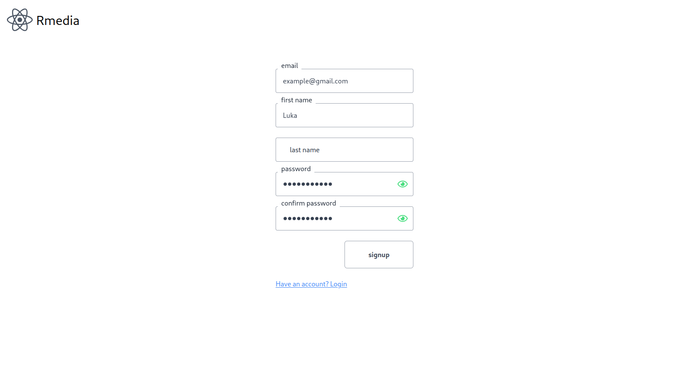
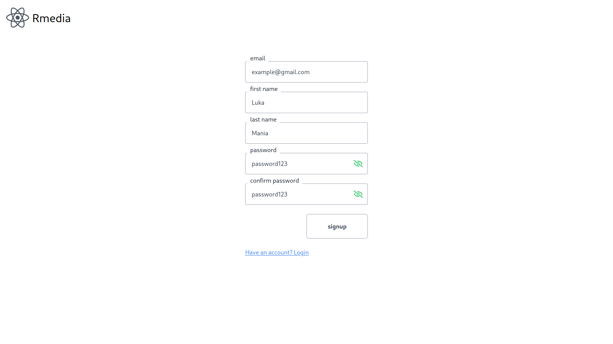

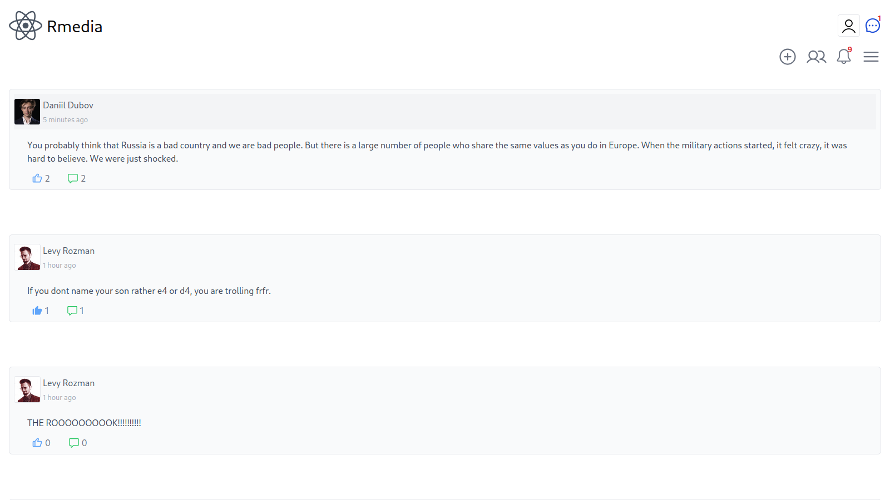

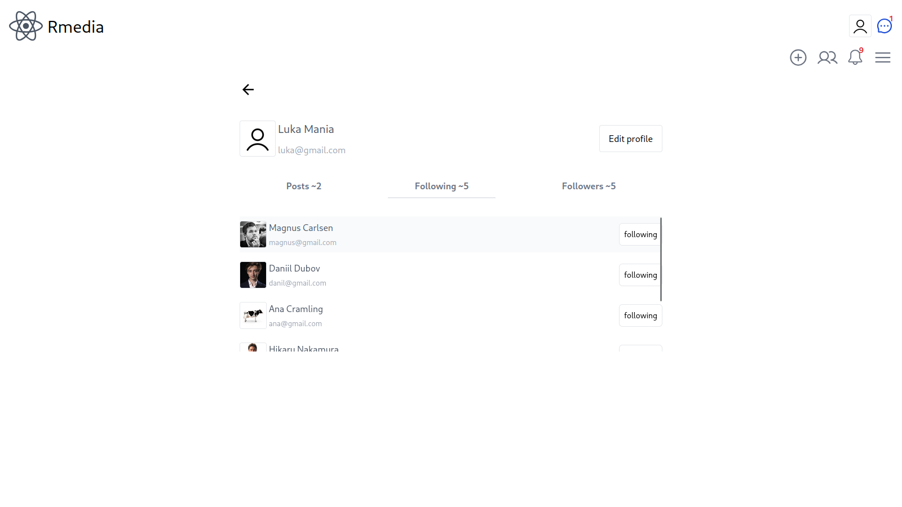
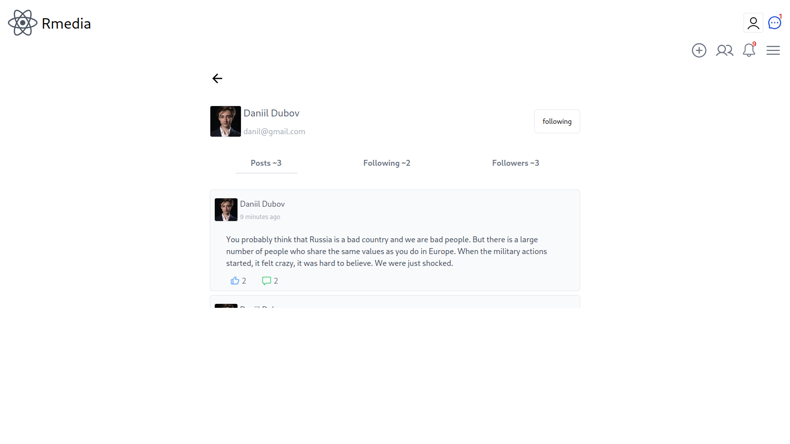
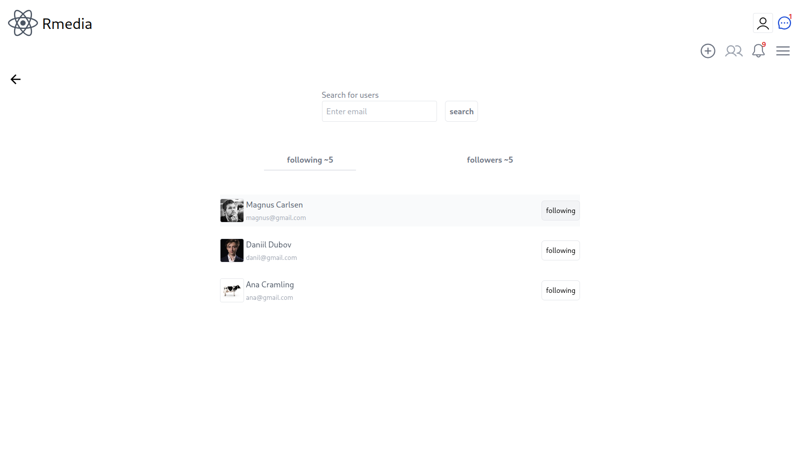

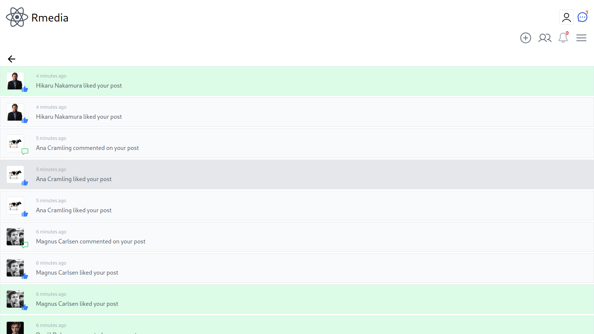

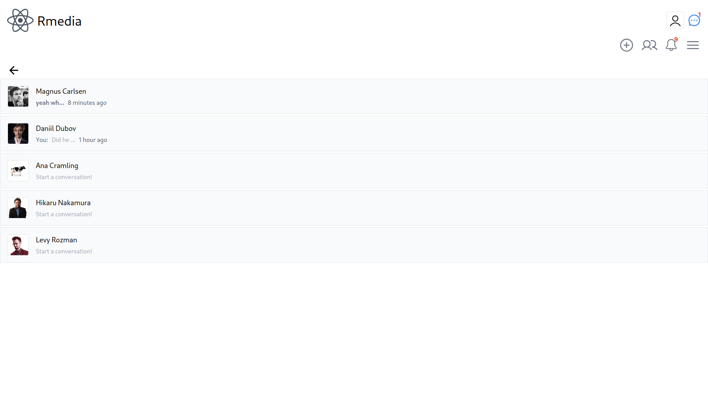
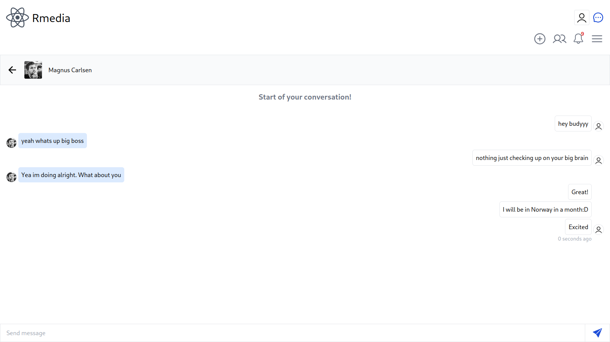


### Mobile

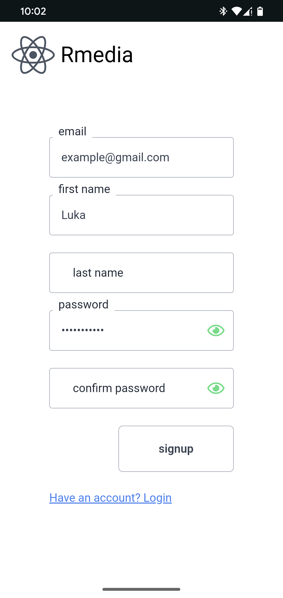
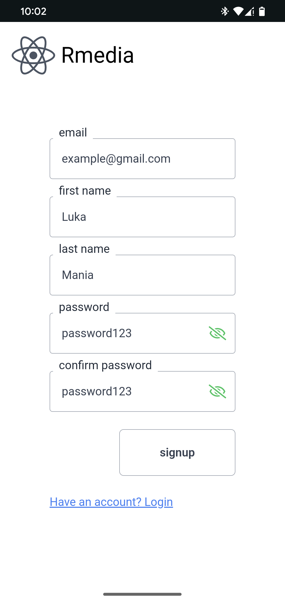

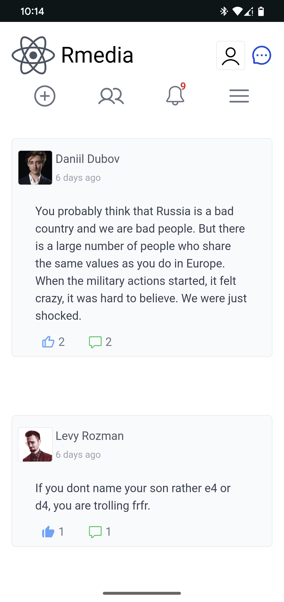

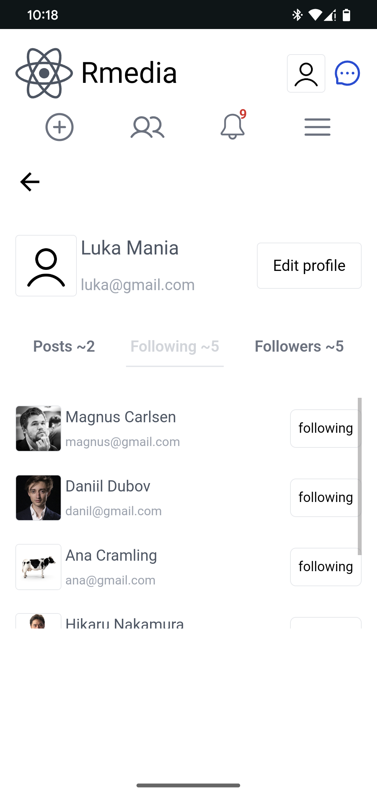
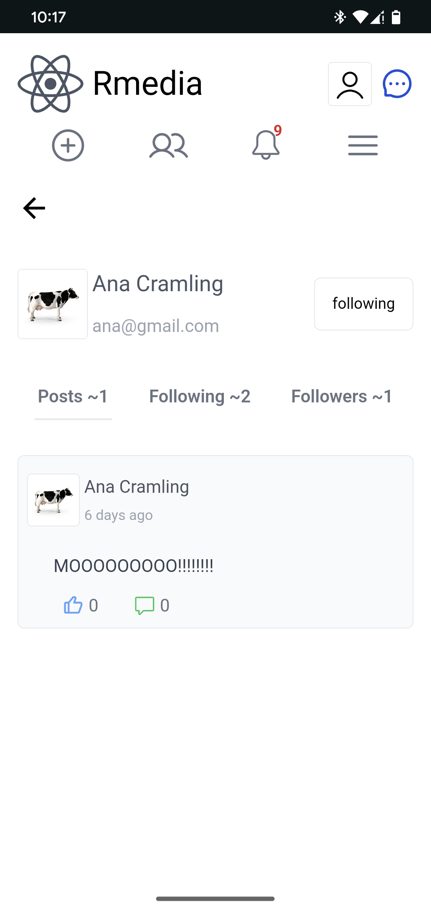
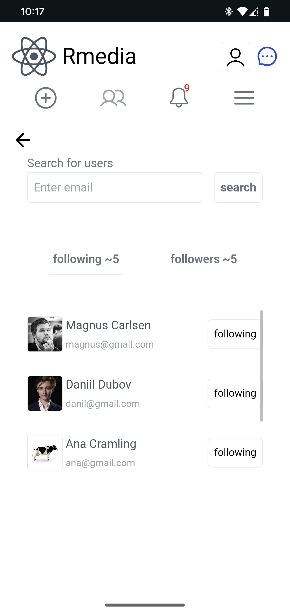

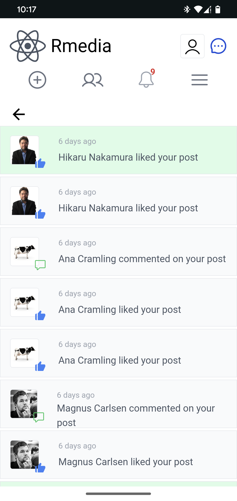

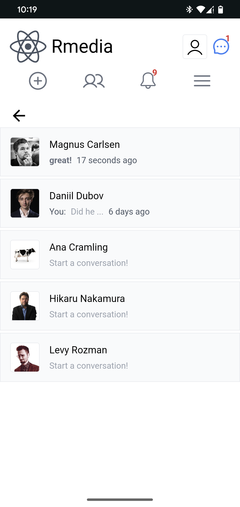
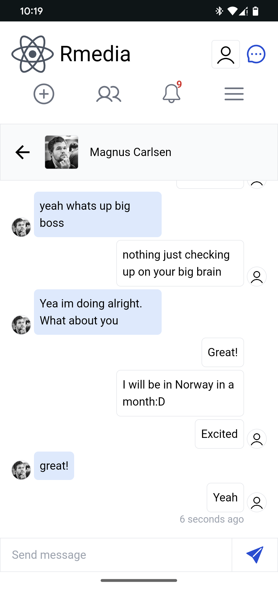

**@dayzyyinwl**
